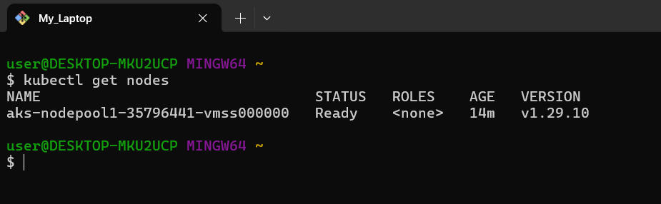
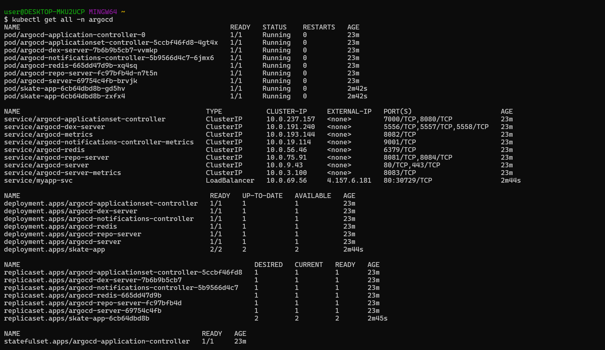
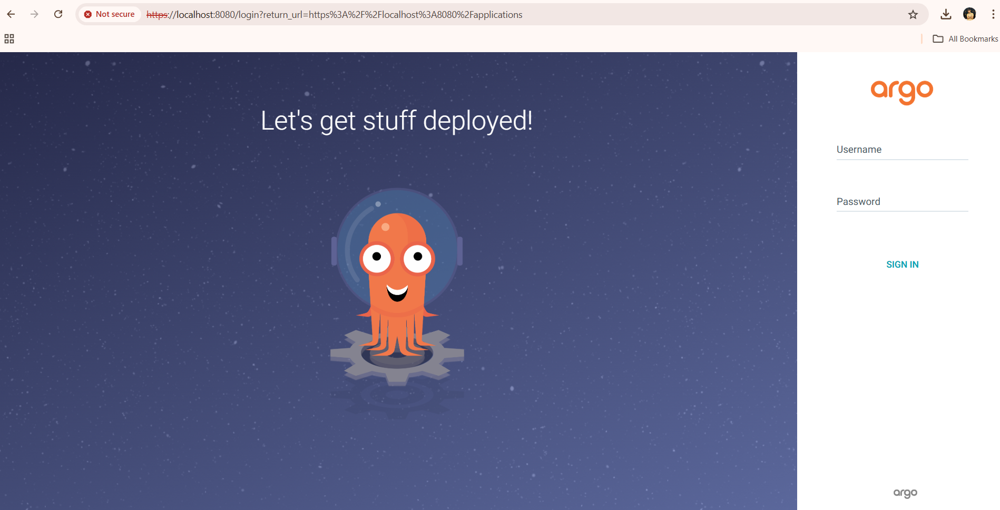
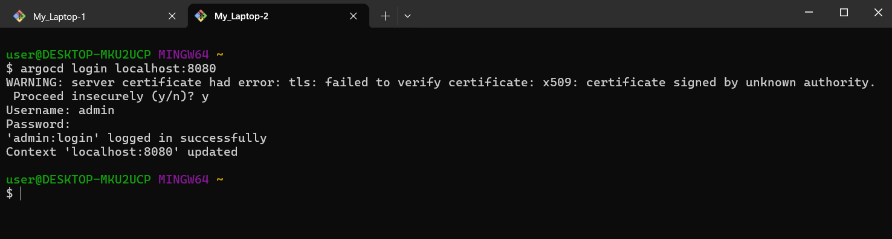
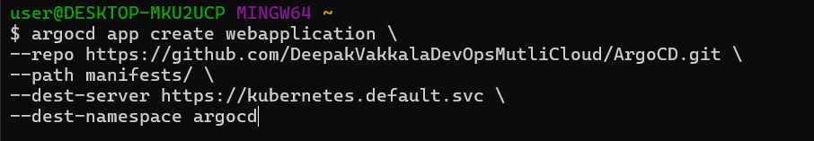
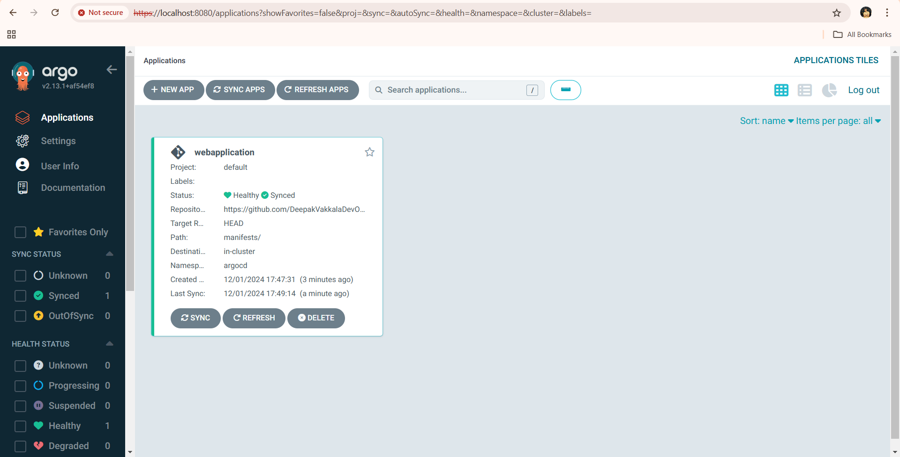
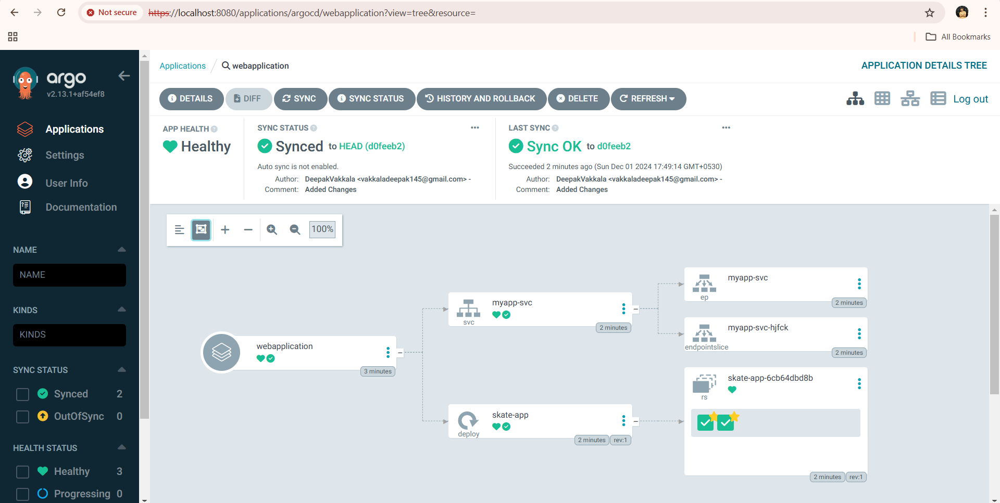
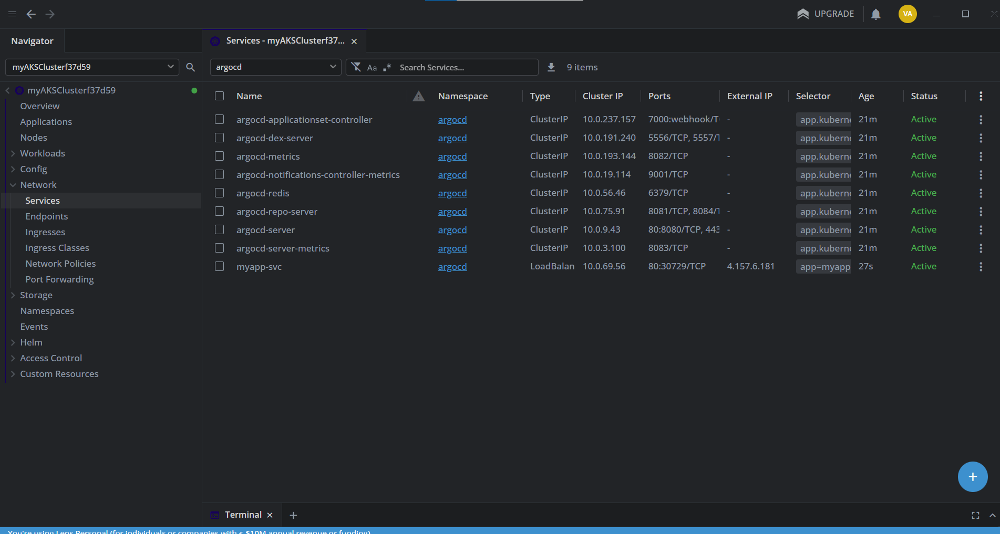
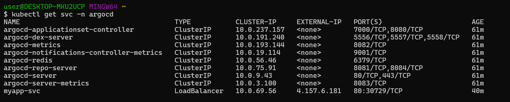

# ArgoCD Deployment Guide

This guide explains how to set up **ArgoCD** on your Kubernetes cluster and manage your applications using it.

---

## Prerequisites

- Kubernetes cluster up and running.
  [AKS](https://learn.microsoft.com/en-us/azure/aks/learn/quick-kubernetes-deploy-cli)
- `kubectl` installed and configured to interact with your cluster.
   

- `manifest` files for your application
- Admin access to the cluster.

- [lens](https://docs.k8slens.dev/getting-started/install-lens/) Install lens if required


# Step 1: Set Up the Git Repository

## Create a Git Repository

1. **Create a New Repository**:  
   Create a new Git repository on your preferred Git hosting service, such as:

   - [GitHub](https://github.com/)
   - [GitLab](https://gitlab.com/)
   - [Bitbucket](https://bitbucket.org/)

2. **Clone the Repository**:  
   Clone the newly created repository to your local machine using the following command:

   ```bash
   git clone <repository-url>
   cd <repository-name>
   ```

## Add a Sample Kubernetes Manifest

### Example: SkateBoard Application

1. **Create a File**:  
   Create a file named `Deployment.yaml` in your repository.

2. **Add the Following Content**:  
   Copy and paste the below YAML manifest into the `Deployment.yaml` file.

   ```yaml
   apiVersion: apps/v1
   kind: Deployment
   metadata:
   name: skate-app
   labels:
       app: webapp
   spec:
   minReadySeconds: 5
   replicas: 2
   selector:
       matchLabels:
       app: webapp
   template:
       metadata:
       labels:
           app: webapp
       spec:
       containers:
           - name: nginx
           image: prachiii123/skate:1.0
           ports:
               - containerPort: 80
               protocol: TCP
           resources:
               requests:
               memory: 50Mi
               cpu: 0.5m
               limits:
               memory: 100Mi
               cpu: 0.5m

    ---
       apiVersion: v1
       kind: Service
       metadata:
       name: webapp-service
       spec:
       type: NodePort
       selector:
           app: webapp
       ports:
           - port: 80
           targetPort: 80
   ```

3. Push the Files to Git:
   ```bash
       git add .
       git commit -m "Add SkateBoard Kubernetes manifests"
       git push origin main
   ```

# Step 2: Install ArgoCD

### Option 1: Install via YAML Manifest

Run the following command to install ArgoCD:

```bash
kubectl create namespace argocd
kubectl apply -n argocd -f https://raw.githubusercontent.com/argoproj/argo-cd/stable/manifests/install.yaml
```
- to see if installed successfully
```bash
   kubectl  get all -n argocd
```



# Step 3: Expose ArgoCD Server

### Option 1: Using a LoadBalancer

    Edit the ArgoCD server service to expose it via LoadBalancer.
    ```bash
    kubectl edit svc argocd-server -n argocd
    ```

### Option 2: Using Port Forwarding

1. **Run the Following Command**:  
   Use the command below to port-forward the ArgoCD server service to your local machine:

   ```bash
   kubectl port-forward svc/argocd-server -n argocd 8080:443
   ```
   
# Step 4: Create the ArgoCD Application

### Login to Argo CD

1. **Retrieve the Admin Password**:  
   Run the following command to retrieve the initial admin password:


   ```bash
   kubectl get secret argocd-initial-admin-secret -n argocd -o jsonpath="{.data.password}" | base64 -d
   ```
   
### Login via the CLI

  **Use the Argo CD CLI to Log In**:  
   Run the following command to log in to the Argo CD server. If you are not using port forwarding, replace `localhost:8080` with your actual server address.

   ```bash
   argocd login localhost:8080
   ```
   

## Add Your Git Repository to Argo CD

1. **Add the Git Repository**:  
   Replace `<GIT_REPO_URL>` with the URL of your repository and run the following command:

   ```bash
   argocd repo add <GIT_REPO_URL>
   ```
## Create an Argo CD Application

1. **Run the Following Command**:  
   Replace `<GIT_REPO_URL>` with your Git repository URL and execute the command to create an application in Argo CD:

   ```bash
   argocd app create webapplication \
   --repo <GIT_REPO_URL> \
   --path manifests \
   --dest-server https://kubernetes.default.svc \
   --dest-namespace default
   ```
   
# Step 5: Sync the Application via UI

1. **Access the Argo CD Web UI**:  
   Open the Argo CD UI in your browser at [https://localhost:8080](https://localhost:8080).
   

2. **Login**:  
   Log in using the `admin` credentials.


3. **Click on the `webapplication` Application**:  
   Find and click on the `webapplication` application in the list of applications.
   


4. **Click the “Sync” Button**:  
   In the application details page, click the **Sync** button to deploy the application.
   
5.  Verify the Deployment

     Check the Resources in the Kubernetes Cluster
     or you can check it via lens.
     
     - to check our aaplication is runnning or not
     copy the `external-ip` of deployment service 
     and paste in on website
     like `http://<external-ip>:port`
     
     


    Run the following command to check the resources in the `default` namespace:

    ```bash
    kubectl get all -n default
    ```
# Step 6: To delete the application
 ```bash
 argocd app delete webapplication --cascade
```

###### Here above are the steps for deploying an application in aks cluster with the help of **ArgCD**.

Happy Learning ! :happy: